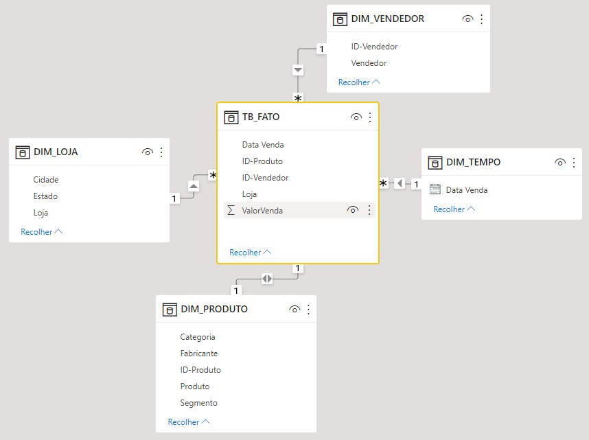

<h1> 🏪 Dashboard de vendas loja Ponto Máximo </h1>

<h4 align="center"> 📊 <a href = "" > Para visualizar o dashboard completo clique aqui. </a></h4>

 A empresa começou sua operação no Brasil em 2012 e atua nos quatro estados da região sudeste
mais os estados do Paraná e Bahia.
A empresa está montando a estratégia de vendas para o próximo ano e precisa saber qual
dos fabricantes dos produtos vendidos, apresenta melhor desempenho nas vendas. <b>O objetivo é
descartar os fabricantes cujos produtos possuem poucas vendas e tentar negociar melhores condições com os principais fabricantes.</b>
Em paralelo a isso, a empresa gostaria de ter <b>diferentes visões das vendas realizadas nos
últimos 4 anos</b> (período de 2012 a 2015). Deve ser possível segmentar os relatórios de vendas
por diferentes informações e por diferentes ângulos. Estas informações irão suportar as
estratégias da empresa para o próximo ano.

## 🕵🏽‍♀️ O que quero visualizar

1. Quantidade de vendas por produto, loja, vendedor e tempo.

2. Qual das fabricantes apresenta melhor desempenho nas vendas?

3. Qual total de vendas por segmento?

4. Qual total de vendas por estado e categoria?

5. Qual segmento com maior influencia no valor de vnedas?

6. Qual loja com maior número de vendas e maior valor de vendas?

7. Qual vendedor com maior número de vendas e maior valor de vendas por loja? 

## 🗂️ Fonte de dados

Sua fonte de dados é um arquivo Excel com dados coletados do sistema de vendas, CRM
e ERP da empresa. O conjunto de dados foi entregue pelo departamento de TI com as seguintes
colunas:

Coluna | Descrição
--- | ---
ID-Produto | Identificador do produto
Produto | Nome do produto
Categoria | Categoria do produto
Segmento | Segmento do produto
Fabrincante | Nome do fabricante
loja | Nome da loja
Cidade | Cidade da loja
Estado | Estado da loja
Vendedor | Nome do vendedor
ID-Vendedor | Identificador do vendedor
DataVenda | Data da venda
ValorVenda | Valor da venda

## ♻️ Transformações

- Criar as dimensões: <b>*DIM_PRODUTO, DIM_LOJA, DIM_TEMPO, DIM_VENDEDOR*</b>

- Criar <b>*TB_FATO;*</b>

- Remover duplicadas;

## ⭐ Relações: modelo Star Schema

    

